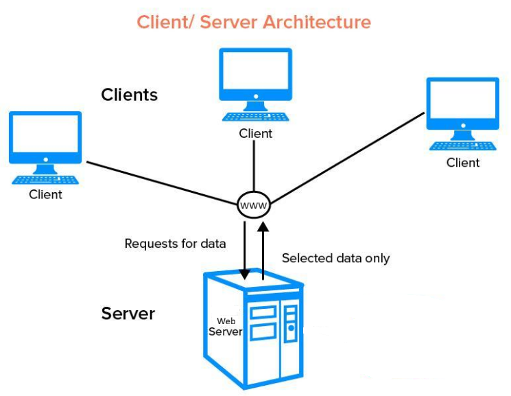
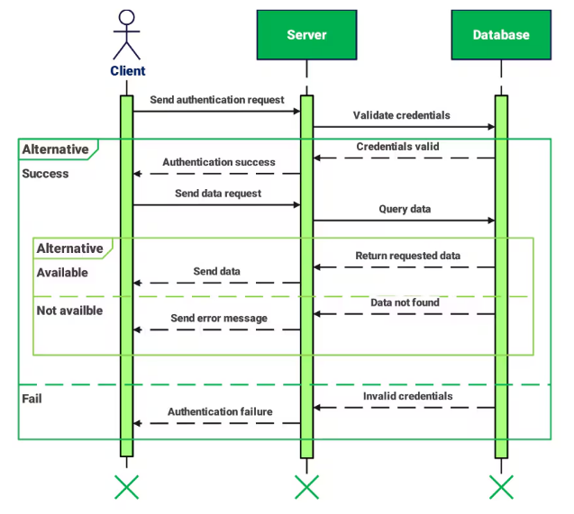

# 🚀 Space Bot API Investigation Sheet

**Total Marks: 30**  
**Part 1: Collect Required API Documentation**

This investigation sheet helps you gather key technical information from the three APIs required for the Space Bot project: **Webex Messaging API**, **ISS Current Location API**, and a **Geocoding API** (LocationIQ or Mapbox or other), plus the Python time module.

---

## ✅ Section 1: Webex Messaging API (7 marks)

| Criteria | Details                                                                                                                                                                                                                                                                                                                                                                                                                                                                                                                                                                                                                                                                                                                                                                                                                                                                                                                                                                                                                                                                                                                                                                                                                                                                                                                         |
|---------|---------------------------------------------------------------------------------------------------------------------------------------------------------------------------------------------------------------------------------------------------------------------------------------------------------------------------------------------------------------------------------------------------------------------------------------------------------------------------------------------------------------------------------------------------------------------------------------------------------------------------------------------------------------------------------------------------------------------------------------------------------------------------------------------------------------------------------------------------------------------------------------------------------------------------------------------------------------------------------------------------------------------------------------------------------------------------------------------------------------------------------------------------------------------------------------------------------------------------------------------------------------------------------------------------------------------------------|
| API Base URL | `https://webexapis.com/v1/`                                                                                                                                                                                                                                                                                                                                                                                                                                                                                                                                                                                                                                                                                                                                                                                                                                                                                                                                                                                                                                                                                                                                                                                                                                                                                                     |
| Authentication Method | `OAuth 2.0 Bearer Token`                                                                                                                                                                                                                                                                                                                                                                                                                                                                                                                                                                                                                                                                                                                                                                                                                                                                                                                                                                                                                                                                                                                                                                                                                                                                                                        |
| Endpoint to list rooms | `https://webexapis.com/v1/rooms`                                                                                                                                                                                                                                                                                                                                                                                                                                                                                                                                                                                                                                                                                                                                                                                                                                                                                                                                                                                                                                                                                                                                                                                                                                                                                                |
| Endpoint to get messages | `https://webexapis.com/v1/messages`                                                                                                                                                                                                                                                                                                                                                                                                                                                                                                                                                                                                                                                                                                                                                                                                                                                                                                                                                                                                                                                                                                                                                                                                                                                                                             |
| Endpoint to send message | `https://webexapis.com/v1/messages`                                                                                                                                                                                                                                                                                                                                                                                                                                                                                                                                                                                                                                                                                                                                                                                                                                                                                                                                                                                                                                                                                                                                                                                                                                                                                             |
| Required headers | `Authorization: Bearer <access_token>`, `Accept: application/json`                                                                                                                                                                                                                                                                                                                                                                                                                                                                                                                                                                                                                                                                                                                                                                                                                                                                                                                                                                                                                                                                                                                                                                                                                                                              |
| Sample full GET or POST request | [{'created': '2025-10-12T14:03:18.514Z', 'creatorId': 'Y2lzY29zcGFyazovL3VzL1BFT1BMRS9hZWMxOWZhOC1hNWQyLTQxZTgtODU2OS05ZTE4MGIzZWU2ODM', 'description': 'This room is used by the project ISS Bot to post ' 'announcements about ISS flyovers.', 'id': 'Y2lzY29zcGFyazovL3VybjpURUFNOnVzLXdlc3QtMl9yL1JPT00vMzQ1ZTg1MjAtYTc3NC0xMWYwLTg3ZDctYjlmNTIyYjU3YmQ2', 'isLocked': False,   'isPublic': False,   'isReadOnly': False,   'lastActivity': '2025-10-12T14:03:18.514Z',   'ownerId': 'Y2lzY29zcGFyazovL3VzL09SR0FOSVpBVElPTi9iZGQyYWVkMi1kYTE3LTQ4MWQtYmQ2Zi1iNDMwMzdlZTkwYjc',   'title': 'Project ISS Bot Announcements',   'type': 'group'},  {'created': '2025-10-12T14:02:45.214Z',   'creatorId': 'Y2lzY29zcGFyazovL3VzL1BFT1BMRS9hZWMxOWZhOC1hNWQyLTQxZTgtODU2OS05ZTE4MGIzZWU2ODM',   'description': 'This room is used by the project ISS Bot to post '                  'announcements about ISS flyovers.',   'id': 'Y2lzY29zcGFyazovL3VybjpURUFNOnVzLXdlc3QtMl9yL1JPT00vMjA4NTU3ZTAtYTc3NC0xMWYwLThkYmQtM2JhZjMzYjQ2Nzc2',   'isLocked': False,   'isPublic': False,   'isReadOnly': False,  'lastActivity': '2025-10-12T14:02:45.214Z',   'ownerId': 'Y2lzY29zcGFyazovL3VzL09SR0FOSVpBVElPTi9iZGQyYWVkMi1kYTE3LTQ4MWQtYmQ2Zi1iNDMwMzdlZTkwYjc',   'title': 'Project ISS Bot Announcements',   'type': 'group'}] |

---

## 🛰️ Section 2: ISS Current Location API (3 marks)

| Criteria | Details                                   |
|---------|-------------------------------------------|
| API Base URL | `http://api.open-notify.org/`             |
| Endpoint for current ISS location | `http://api.open-notify.org/iss-now.json` |
| Sample response format (example JSON) | {"message": "success", "iss_position": {"longitude": "-36.9020", "latitude": "51.4174"}, "timestamp": 1759761471} |  
```

```

---

## 🗺️ Section 3: Geocoding API (LocationIQ or Mapbox or other) (6 marks)

| Criteria                                 | Details                                                                                                                                                                                                                                                                                                                                                                                                                                                                                                                                                                                                                                                                |
|------------------------------------------|------------------------------------------------------------------------------------------------------------------------------------------------------------------------------------------------------------------------------------------------------------------------------------------------------------------------------------------------------------------------------------------------------------------------------------------------------------------------------------------------------------------------------------------------------------------------------------------------------------------------------------------------------------------------|
| Provider used (circle one)               | **LocationIQ**                                                                                                                                                                                                                                                                                                                                                                                                                                                                                                                                                                                                                                                         |
| API Doc                                  | https://docs.locationiq.com/reference/reverse-api                                                                                                                                                                                                                                                                                                                                                                                                                                                                                                                                                                                                                      |
| API Base URL                             | `https://eu1.locationiq.com/v1/`                                                                                                                                                                                                                                                                                                                                                                                                                                                                                                                                                                                                                                       |
| Endpoint for reverse geocoding           | `https://eu1.locationiq.com/v1/reverse`                                                                                                                                                                                                                                                                                                                                                                                                                                                                                                                                                                                                                                |
| Authentication method                    | `API Key`                                                                                                                                                                                                                                                                                                                                                                                                                                                                                                                                                                                                                                                              |
| Required query parameters                | `key, lat, lon, format`                                                                                                                                                                                                                                                                                                                                                                                                                                                                                                                                                                                                                                                |
| Sample request with latitude/longitude   | https://eu1.locationiq.com/v1/reverse?key=pk.6b11667ec7f2f2dd378b1cec9b4d152e&lat=51.50344025&lon=-0.12770820958562096&format=json                                                                                                                                                                                                                                                                                                                                                                                                                                                                                                                                     |
| Sample JSON response (formatted example) | {"place_id":"274058577","licence":"https:\/\/locationiq.com\/attribution","osm_type":"relation","osm_id":"1879842","lat":"51.503487750000005","lon":"-0.12769645443243238","display_name":"10 Downing Street, 10, Downing Street, Westminster, Millbank, London, Greater London, England, SW1A 2AA, United Kingdom","address":{"government":"10 Downing Street","house_number":"10","road":"Downing Street","quarter":"Westminster","suburb":"Millbank","city":"London","state_district":"Greater London","state":"England","postcode":"SW1A 2AA","country":"United Kingdom","country_code":"gb"},"boundingbox":["51.5033074","51.5036913","-0.1277991","-0.1273088"]} |  
```

```

---

## ⏰ Section 4: Epoch to Human Time Conversion (Python time module) (2 marks)

| Criteria | Details                            |
|---------|------------------------------------|
| Library used | `time`                             |
| Function used to convert epoch | `time.ctime(timestamp)`            |
| Sample code to convert timestamp | timeString = time.ctime(timestamp) |
| Output (human-readable time) | `2025-12-06 13:37:51` |

---

## 🧩 Section 5: Web Architecture & MVC Design Pattern (12 marks)

Web Architecture is the conceptual structure and organization of a web application or website.
In a basic way, it is often based on the Client-Server Model.
It's main components are:

- Client: The frontend or user interface, typically a web browser or mobile app, sends requests to the server.
- Server: A powerful machine or system that processes client requests, performs business logic, and returns responses.
- Database: A storage system that holds data and information used by the application.
- 
MVS stands for Model-View-Controller.
It is a software design pattern commonly used for developing user interfaces that divides an application into three interconnected components:
- Model: Represents the data and business logic of the application. It manages the data, logic, and rules of the application.
- View: Represents the user interface of the application. It displays data from the Model to the user and sends user commands to the Controller.
- Controller: Acts as an intermediary between the Model and the View. It receives user input from the View, processes it (often by calling methods on the Model), and returns the results to the View for display.
- This separation of concerns helps in organizing code, making it more maintainable, scalable, and testable.


### 🌐 Web Architecture – Client-Server Model

- **Client**: The frontend or user interface, typically a web browser or mobile app, sends requests to the server.
- **Server**: A powerful machine or system that processes client requests, performs business logic, and returns responses.
- (Explain the communication between them & include a block diagram )

The client-server model can visually be represented as follows whereas the client sends requests to the server and the server processes these requests and sends back responses.



The sequence diagram below illustrates the interaction between the client and server during a typical request-response cycle.
Client sends a request to the server, the server processes the request, and then sends back a response to the client.



The Client-Server Model is a distributed application structure that partitions tasks or workloads between service providers, called servers, and service requesters, called clients.
- Clients initiate communication by sending requests to servers, which then process these requests and return the appropriate responses.
- This model allows for centralized management of resources and services, making it easier to maintain and scale applications.
- It is widely used in web applications, where web browsers (clients) interact with web servers to access websites and services.
- Servers are typically more powerful machines that handle multiple client requests simultaneously.
- Clients are usually less powerful devices that rely on servers for processing and data storage.


### 🔁 RESTful API Usage
 
A RESTful API (Representational State Transfer) is a web service that follows the principles of REST architecture.
It allows different software applications to communicate with each other over the internet using standard HTTP methods.
- RESTful APIs are designed to be stateless, meaning that each request from a client to a server must contain all the information needed to understand and process the request.
- They use URIs (Uniform Resource Identifiers) to identify resources, which can be anything from data objects to services.
- They use standard HTTP methods such as GET, POST, PUT, DELETE, etc., to perform operations on resources.
- Resources are typically represented in formats like JSON or XML.
- RESTful APIs are widely used for building web services and applications because they are simple, scalable, and easy to use.
- They enable developers to create applications that can interact with other applications and services over the web.


### 🧠 MVC Pattern in Space Bot

| Component   | Description                                                                                                                                                                                                                                                                                                                                                       |
|------------|-------------------------------------------------------------------------------------------------------------------------------------------------------------------------------------------------------------------------------------------------------------------------------------------------------------------------------------------------------------------|
| **Model**  | It has all the "business" logic such as processing inputs from the user, processing REST API responses, converting epoch time to human readable time.                                                                                                                                                                                                             |
| **View**   | In space bot, it is represented by Command Line Interface (CLI). It displays text messages to the user and also displays results of calling APIs, showig list of rooms available, last message from the selected room, any error messages and also takes inputs from the user such as access token for webex API, name of the webex room to monitor for commands. |
| **Controller** | This handles the input from the user such as access token being entered, webex room selected for monitoring and makes REST API calls and then performs updates to the model by setting corresponding variables in my bot.                                                                                                                                         |


#### Example:
- Model: An example of Model here could be a function that calls the ISS Current Location API, retrieves the current latitude and longitude of the ISS, and processes the JSON response to extract the relevant data.
- 
- View: An example of View here could be a function that takes the latitude and longitude data from the Model and formats it into a user-friendly message, such as "The current location of the ISS is Latitude: 51.4174, Longitude: -36.9020", and displays it to the user.
- 
- Controller: An example of Controller here could be a function that listens for user commands in the Webex room, such as "/4", and when it detects this command, it calls the appropriate Model functions to get the ISS location data and then calls the View function to display the formatted message to the user and then another function to send it to a monitored Webex room.

---

### 📝 Notes

- Use official documentation for accuracy (e.g. developer.webex.com, locationiq.com or Mapbox, open-notify.org or other ISS API).
- Be prepared to explain your findings to your instructor or demo how you retrieved them using tools like Postman, Curl, or Python scripts.

---

## 🗺️ Extended features: SpaceX API

| Criteria                                  | Details                                                                                                                                                                                                                                                                                                                                                                                                                                                                                                                                                                                                                                                               |
|-------------------------------------------|-----------------------------------------------------------------------------------------------------------------------------------------------------------------------------------------------------------------------------------------------------------------------------------------------------------------------------------------------------------------------------------------------------------------------------------------------------------------------------------------------------------------------------------------------------------------------------------------------------------------------------------------------------------------------|
| API Base URL                              | https://api.spacexdata.com/v4                                                                                                                                                                                                                                                                                                                                                                                                                                                                                                                                                                                                                                         |
| Endpoint for the next launch details      | https://api.spacexdata.com/v4/launches/next                                                                                                                                                                                                                                                                                                                                                                                                                                                                                                                                                                                                                                        |
| Endpoint for rocket details               | https://api.spacexdata.com/v4/rockets/{rocket_id}                                                                                                                                                                                                                                                                                                                                                                                                                                                                                                                                                                                                                                    |
| Endpoint for launchpad details            | https://api.spacexdata.com/v4/launchpads/{launchpad_id}                                                                                                                                                                                                                                                                                                                                                                                                                                                                                                                                                                                                                                |
| Github Link                               | https://github.com/r-spacex/SpaceX-API                                                                                                                                                                                                                                                                                                                                                                                                                                                                                                                                                                                                                                              |
| Sample request for the next SpaceX launch | https://api.spacexdata.com/v4/launches/next                                                                                                                                                                                                                                                                                                                                                                                                                                                                                                                                 |
| Sample JSON response (formatted example)  | {"fairings":{"reused":null,"recovery_attempt":null,"recovered":null,"ships":[]},"links":{"patch":{"small":null,"large":null},"reddit":{"campaign":null,"launch":null,"media":null,"recovery":null},"flickr":{"small":[],"original":[]},"presskit":null,"webcast":"https://youtu.be/pY628jRd6gM","youtube_id":"pY628jRd6gM","article":null,"wikipedia":null},"static_fire_date_utc":null,"static_fire_date_unix":null,"net":false,"window":null,"rocket":"5e9d0d95eda69974db09d1ed","success":null,"failures":[],"details":null,"crew":[],"ships":[],"capsules":[],"payloads":["5fe3b86eb3467846b324217c"],"launchpad":"5e9e4502f509094188566f88","flight_number":188,"name":"USSF-44","date_utc":"2022-11-01T13:41:00.000Z","date_unix":1667310060,"date_local":"2022-11-01T09:41:00-04:00","date_precision":"hour","upcoming":true,"cores":[{"core":"5fe3b8f2b3467846b3242181","flight":1,"gridfins":true,"legs":true,"reused":false,"landing_attempt":null,"landing_success":null,"landing_type":null,"landpad":null},{"core":"5fe3b8fbb3467846b3242182","flight":1,"gridfins":true,"legs":true,"reused":false,"landing_attempt":null,"landing_success":null,"landing_type":null,"landpad":null},{"core":"5fe3b906b3467846b3242183","flight":1,"gridfins":true,"legs":true,"reused":false,"landing_attempt":null,"landing_success":null,"landing_type":null,"landpad":null}],"auto_update":true,"tbd":false,"launch_library_id":"2306e0bc-e1a3-4a4a-9285-e1a94073655e","id":"6243aec2af52800c6e91925d"} |  


### ✅ Total: /30


